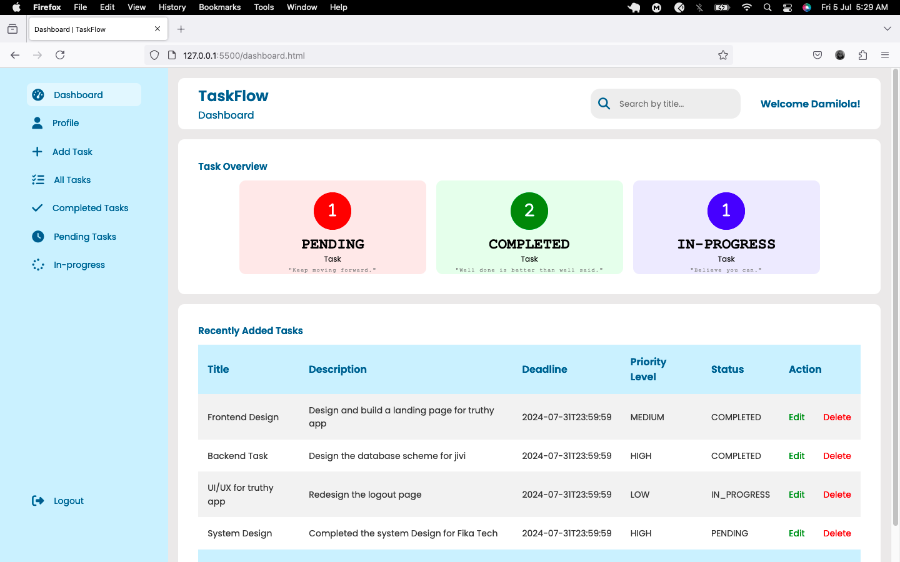

# TaskFlow Frontend

TaskFlow is a task management application designed to help individuals efficiently organize their personal tasks and boost productivity. This repository contains the frontend implementation of TaskFlow, built using HTML, CSS, JavaScript, and Bootstrap. The frontend consumes the API provided by the backend, which is developed in Java.

## Overview

### Background
Individuals require an effective solution to efficiently organize their personal tasks spanning various related and/or unrelated responsibilities, aiming to boost productivity.

### Target Users
Individuals seeking personal task organization.

### User Story
As a user, I want to be able to sign up for an account so that I can access the application and manage my tasks.

#### Acceptance Criteria
- As a new user, I can sign up for a new account.
  - On the sign-up form, I can provide my first name, last name, email, password, confirm password, and phone number.
  - Upon successful sign-up, I should receive a confirmation email with a token to validate my account, after which I can log in using my email and password.
- As a registered user, I can log in to my account.
  - On login, I will use my email and password.
  - Upon successful login, I should be able to:
    1. Create tasks with specific details such as title, description, deadline, and priority level (HIGH, MEDIUM, LOW, NONE).
    2. View details of a specific task by its title or ID.
    3. View all tasks associated with a specific user.
    4. Edit a task successfully.
    5. Delete a task successfully.
    6. Filter tasks by their status (PENDING, IN_PROGRESS, COMPLETED).
    7. View a list of completed tasks separately.
    8. Log out of my account.

## Technologies Used

- **Frontend:**
  - HTML
  - CSS
  - JavaScript
  - Bootstrap

- **Backend:**
  - Spring Boot
  - Spring Security / JWT
  - MySQL 
  - Postman
  - GIT

## Getting Started

### Prerequisites
To run this project, you will need a live backend server for the TaskFlow API. Ensure that the backend is up and running before starting the frontend.

### Installation

1. Clone the repository:
    ```sh
    git clone https://github.com/Tiana-Coker/week10-frontend.git
    cd week10-frontend
    ```

2. Open `index.html` in your preferred web browser to view the application.

## Usage

### Screenshots



### Features

- **User Authentication:**
  - Sign up, login, and receive email confirmation for new accounts.
  
- **Task Management:**
  - Create, view, edit, delete, and filter tasks.
  - View tasks by status and see a list of completed tasks.

- **User Interface:**
  - Clean and responsive design using Bootstrap.

## Contributing

We welcome contributions from the community. To contribute, please follow these steps:

1. Fork the repository.
2. Create a new branch:
    ```sh
    git checkout -b feature/your-feature-name
    ```
3. Make your changes and commit them:
    ```sh
    git commit -m "Add your feature"
    ```
4. Push to the branch:
    ```sh
    git push origin feature/your-feature-name
    ```
5. Open a pull request to the main repository.

## License

This project is licensed under the MIT License.

## Contact

For any questions or suggestions, feel free to reach out or open an issue on GitHub.

---

_Thank you for using TaskFlow!_
